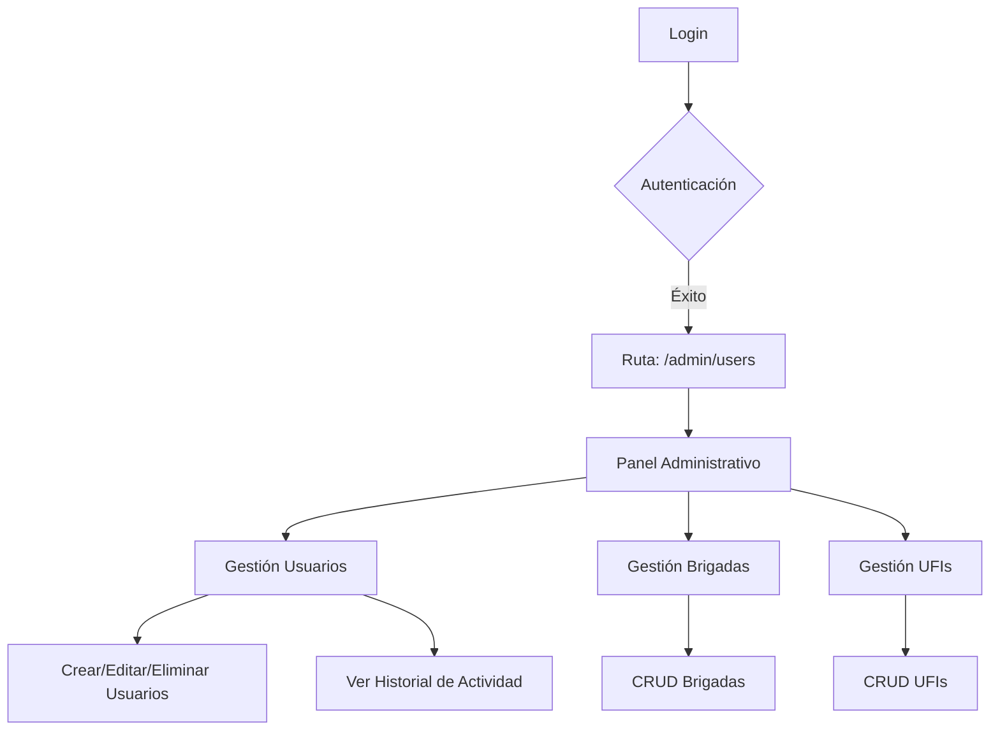
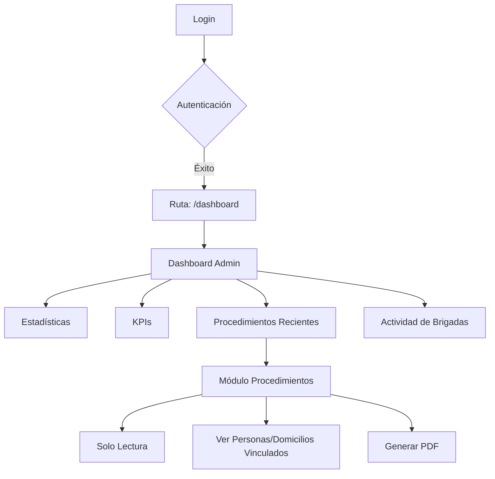
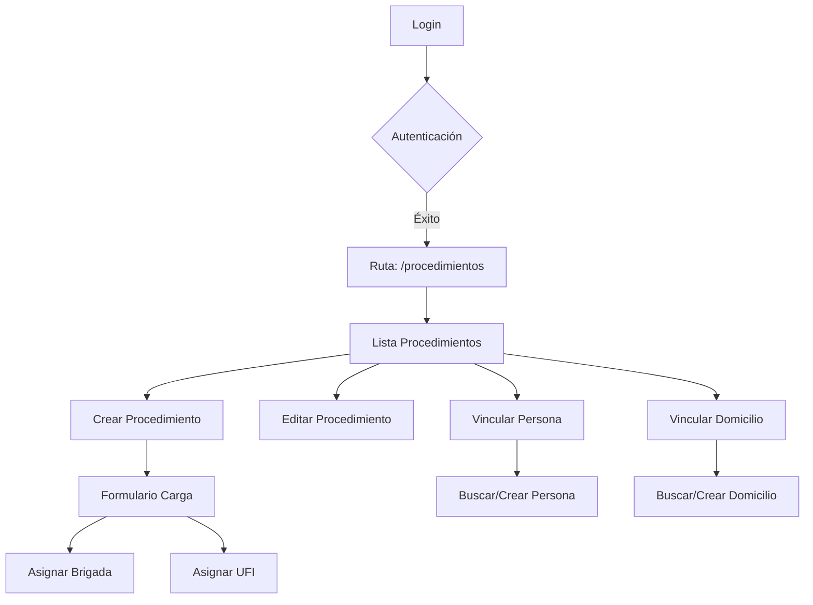
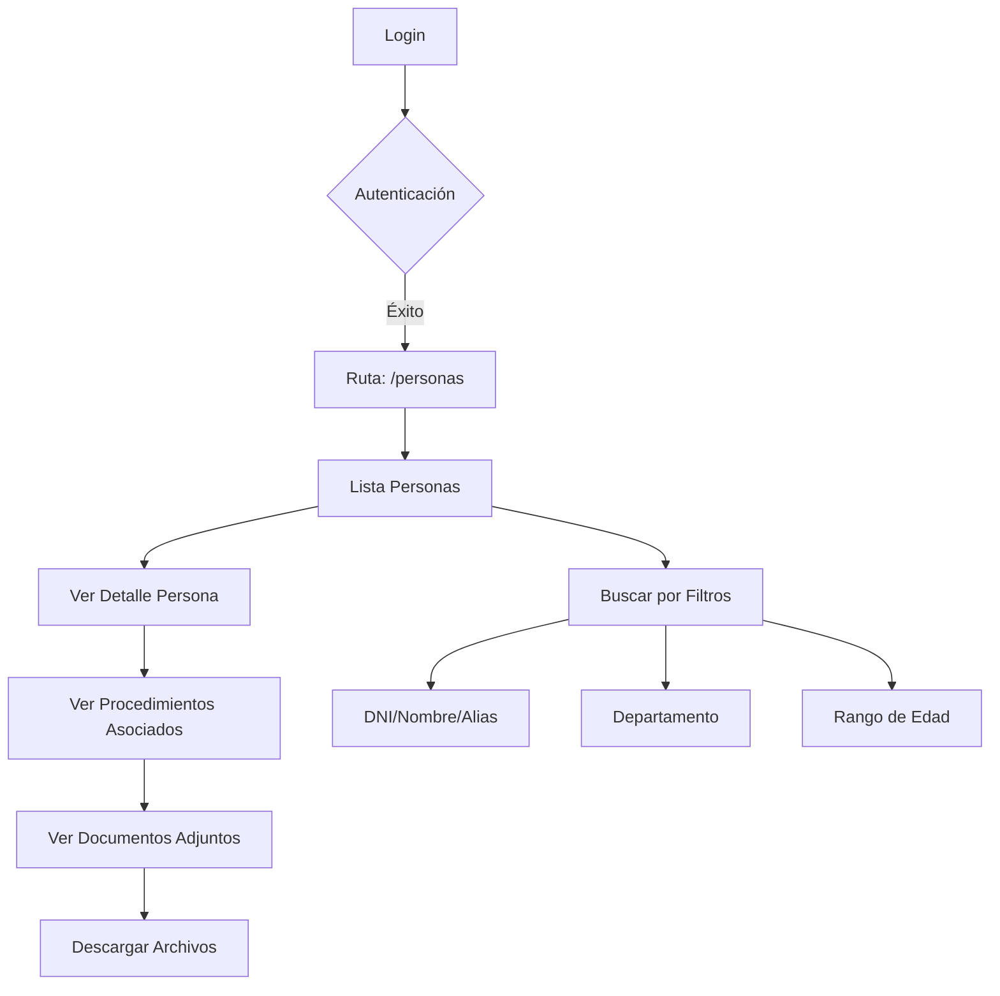

# 🔐 Sistema de Roles y Permisos - ARDIP v1.0

**Documento Técnico para Refactorización del Frontend**  
**Fecha:** 10 de enero de 2026  
**Versión:** 1.0  
**Estado:** Sistema Cerrado (Registro Público Desactivado)

---

## 📋 Tabla de Contenidos

1. [Arquitectura del Sistema de Roles](#arquitectura-del-sistema-de-roles)
2. [Roles Disponibles](#roles-disponibles)
3. [Matriz de Permisos por Rol](#matriz-de-permisos-por-rol)
4. [Flujo de Usuario por Rol](#flujo-de-usuario-por-rol)
5. [Rutas y Accesos](#rutas-y-accesos)
6. [Navegación y Menús](#navegación-y-menús)
7. [Controladores y Middleware](#controladores-y-middleware)
8. [Gates y Políticas](#gates-y-políticas)
9. [Recomendaciones para Frontend](#recomendaciones-para-frontend)

---

## 🏗️ Arquitectura del Sistema de Roles

### Modelo de Datos

```
┌─────────────────┐       ┌─────────────────┐       ┌─────────────────┐
│     users       │       │   role_user     │       │     roles       │
├─────────────────┤       ├─────────────────┤       ├─────────────────┤
│ id              │◄──────┤ user_id         │──────►│ id              │
│ name            │       │ role_id         │       │ name            │
│ email           │       └─────────────────┘       │ label           │
│ password        │                                 └─────────────────┘
│ jerarquia       │
│ brigada_id      │
│ active          │
│ last_login_at   │
└─────────────────┘
```

**Relación:** Many-to-Many (Un usuario puede tener múltiples roles)

### Gates Definidos (AppServiceProvider)

```php
Gate::define('super-admin', fn(User $user) => $user->hasRole('super_admin'));
Gate::define('admin', fn(User $user) => $user->hasRole('admin'));
Gate::define('panel-carga', fn(User $user) => $user->hasRole('panel-carga'));
Gate::define('panel-consulta', fn(User $user) => 
    $user->hasRole('panel-consulta') || $user->hasRole('panel-carga')
);
Gate::define('acceso-operativo', fn(User $user) => 
    $user->hasRole('admin') || 
    $user->hasRole('panel-carga') || 
    $user->hasRole('panel-consulta')
);
```

---

## 👥 Roles Disponibles

### 1️⃣ **super_admin** (Super Administrador)

**Propósito:** Gestión completa del sistema, usuarios, brigadas y UFIs.

**Características:**

- Acceso exclusivo al panel administrativo
- Puede crear, editar y eliminar usuarios
- Gestiona brigadas y UFIs
- **NO** tiene acceso operativo por defecto (Procedimientos, Personas, Documentos)
- Puede combinarse con otros roles para acceso mixto

**Seeder:**

```php
// Usuario: superadmin@ardip.gob.ar / password
```

---

### 2️⃣ **admin** (Administrador del Sistema)

**Propósito:** Supervisión operativa y acceso al dashboard analítico.

**Características:**

- Acceso de **SOLO LECTURA** a módulos operativos
- Dashboard con estadísticas y KPIs
- Puede **VER** procedimientos, personas, documentos
- **NO** puede crear, editar ni eliminar datos operativos
- **NO** puede gestionar usuarios, brigadas ni UFIs
- Rol orientado a jefes de brigada o coordinadores con supervisión

**Seeder:**

```php
// Usuario: admin@ardip.gob.ar / password
```

---

### 3️⃣ **panel-carga** (Operador de Carga)

**Propósito:** Personal de carga de información policial.

**Características:**

- Puede crear, editar y eliminar:
  - Procedimientos
  - Personas
  - Domicilios
  - Documentos
- Acceso completo de lectura (inherente al rol de consulta)
- Vinculación de personas/domicilios a procedimientos
- Generación de PDFs de procedimientos
- **NO** accede a dashboard admin ni gestión de usuarios

**Seeder:**

```php
// Usuario: cargador@ardip.gob.ar / password
```

---

### 4️⃣ **panel-consulta** (Visor de Consultas)

**Propósito:** Personal de consulta sin permisos de escritura.

**Características:**

- Solo lectura en todos los módulos operativos:
  - Ver lista y detalle de procedimientos
  - Ver lista y detalle de personas
  - Ver lista de documentos
  - Descargar documentos adjuntos
- **NO** puede crear, editar ni eliminar
- Dashboard consultor (vista simplificada)
- Búsquedas y filtros avanzados

**Seeder:**

```php
// Usuario: consultor@ardip.gob.ar / password
```

---

## 📊 Matriz de Permisos por Rol

| Módulo / Acción           | super_admin | admin | panel-carga | panel-consulta |
|---------------------------|:-----------:|:-----:|:-----------:|:--------------:|
| **Dashboard Admin**       | ❌*         | ✅    | ❌          | ❌             |
| **Dashboard Consultor**   | ❌          | ❌    | ❌          | ✅             |
| **Gestión Usuarios**      | ✅          | ❌    | ❌          | ❌             |
| **Gestión Brigadas**      | ✅          | ❌    | ❌          | ❌             |
| **Gestión UFIs**          | ✅          | ❌    | ❌          | ❌             |
| **Procedimientos (Ver)**  | ❌*         | ✅    | ✅          | ✅             |
| **Procedimientos (CRUD)** | ❌*         | ❌    | ✅          | ❌             |
| **Personas (Ver)**        | ❌*         | ✅    | ✅          | ✅             |
| **Personas (CRUD)**       | ❌*         | ❌    | ✅          | ❌             |
| **Domicilios (Ver)**      | ❌*         | ✅    | ✅          | ✅             |
| **Domicilios (CRUD)**     | ❌*         | ❌    | ✅          | ❌             |
| **Documentos (Ver)**      | ❌*         | ✅    | ✅          | ✅             |
| **Documentos (Subir)**    | ❌*         | ❌    | ✅          | ❌             |
| **Documentos (Eliminar)** | ❌*         | ❌    | ✅          | ❌             |
| **Perfil (Editar)**       | ✅          | ✅    | ✅          | ✅             |

**\* Nota:** super_admin **puro** (sin otros roles) NO tiene acceso operativo. Si se le asigna admin u otro rol operativo, hereda esos permisos.

---

## 🚦 Flujo de Usuario por Rol

### 1. **Super Administrador** (super_admin)



**Ruta Inicial:** `/admin/users` → Panel de Gestión de Usuarios

**Navegación Disponible:**

- 🧑‍💼 Gestión Usuarios
- 🛡️ Brigadas
- 🏛️ UFIs
- 👤 Perfil

**Sin Acceso:**

- ❌ Dashboard Admin
- ❌ Procedimientos
- ❌ Personas
- ❌ Documentos

---

### 2. **Administrador** (admin)



**Ruta Inicial:** `/dashboard` → Dashboard Analítico

**Navegación Disponible:**

- 📊 Dashboard
- 📁 Procedimientos (👁️ Solo Lectura)
- 👥 Personas (👁️ Solo Lectura)
- 📚 Biblioteca Digital (👁️ Solo Lectura)
- 👤 Perfil

**Sin Acceso:**

- ❌ Gestión de Usuarios
- ❌ Brigadas
- ❌ UFIs
- ❌ Crear/Editar/Eliminar Datos Operativos

---

### 3. **Operador de Carga** (panel-carga)



**Ruta Inicial:** `/procedimientos` → Listado de Procedimientos

**Navegación Disponible:**

- 📁 Procedimientos (CRUD + Vincular)
- 👥 Personas (CRUD)
- 📚 Biblioteca Digital (Subir/Eliminar)
- 👤 Perfil

**Acciones Típicas:**

1. Crear nuevo procedimiento
2. Asignar brigada y UFI
3. Vincular personas involucradas
4. Vincular domicilios
5. Adjuntar documentos (fotos, PDFs)
6. Generar informe PDF

**Sin Acceso:**

- ❌ Dashboard
- ❌ Gestión Admin

---

### 4. **Visor de Consultas** (panel-consulta)



**Ruta Inicial:** `/personas` → Listado de Personas

**Navegación Disponible:**

- 👥 Personas (Solo Lectura)
- 📁 Procedimientos (Solo Lectura)
- 📚 Biblioteca Digital (Solo Descarga)
- 📊 Dashboard Consultor (vista simplificada)
- 👤 Perfil

**Acciones Típicas:**

1. Buscar personas por DNI/Alias
2. Ver historial de procedimientos
3. Consultar domicilios asociados
4. Descargar documentos adjuntos
5. Filtrar procedimientos por brigada/UFI

**Sin Acceso:**

- ❌ Crear/Editar/Eliminar cualquier dato
- ❌ Dashboard Admin
- ❌ Gestión Admin

---

## 🛣️ Rutas y Accesos

### Rutas Públicas (Guest)

| Ruta                | Método | Descripción                  |
|---------------------|--------|------------------------------|
| `/`                 | GET    | Redirige a login si guest    |
| `/login`            | GET    | Pantalla de login            |
| `/login`            | POST   | Procesar autenticación       |
| `/forgot-password`  | GET    | Solicitar reset de contraseña|
| `/reset-password`   | GET    | Resetear contraseña con token|

**Nota:** `/register` está **DESACTIVADO** (Sistema Cerrado)

---

### Rutas Protegidas (Auth + Verified)

#### 🏠 Dashboard

| Ruta                   | Middleware           | Roles Permitidos      |
|------------------------|----------------------|-----------------------|
| `/dashboard`           | `can:admin`          | admin                 |
| `/dashboard-consultor` | `can:panel-consulta` | panel-consulta        |

---

#### 🧑‍💼 Módulo Administrativo (Prefijo: `/admin`)

| Ruta                            | Middleware           | Acción              | Rol Requerido |
|---------------------------------|----------------------|---------------------|---------------|
| `/admin/users`                  | `can:super-admin`    | Lista usuarios      | super_admin   |
| `/admin/users/create`           | `can:super-admin`    | Crear usuario       | super_admin   |
| `/admin/users/{user}`           | `can:super-admin`    | Ver usuario         | super_admin   |
| `/admin/users/{user}/edit`      | `can:super-admin`    | Editar usuario      | super_admin   |
| `/admin/users/{user}`           | `can:super-admin`    | Eliminar usuario    | super_admin   |
| `/admin/users/{user}/history`   | `can:super-admin`    | Historial actividad | super_admin   |
| `/admin/brigadas`               | `can:super-admin`    | CRUD Brigadas       | super_admin   |
| `/admin/ufis`                   | `can:super-admin`    | CRUD UFIs           | super_admin   |

**Middleware Extra:** `super.admin.activity` (registra logs de acciones críticas)

---

#### 📁 Procedimientos

| Ruta                                              | Middleware                 | Acción                    | Roles Permitidos         |
|---------------------------------------------------|----------------------------|---------------------------|--------------------------|
| `/procedimientos`                                 | `can:acceso-operativo`     | Lista                     | admin, carga, consulta   |
| `/procedimientos/create`                          | `can:operativo-escritura`  | Crear                     | panel-carga              |
| `/procedimientos/{procedimiento}`                 | `can:acceso-operativo`     | Ver detalle               | admin, carga, consulta   |
| `/procedimientos/{procedimiento}/edit`            | `can:operativo-escritura`  | Editar                    | panel-carga              |
| `/procedimientos/{procedimiento}`                 | `can:operativo-escritura`  | Eliminar                  | panel-carga              |
| `/procedimientos/{procedimiento}/vincular-persona`| `can:operativo-escritura`  | Vincular persona          | panel-carga              |
| `/procedimientos/{procedimiento}/vincular-domicilio`| `can:operativo-escritura`| Vincular domicilio        | panel-carga              |
| `/procedimientos/{procedimiento}/pdf`             | `can:acceso-operativo`     | Generar PDF               | admin, carga, consulta   |

**Controlador:** `ProcedimientoController`

**Middleware en Controlador:**

```php
$this->middleware('can:operativo-escritura')->only([
    'create', 'store', 'edit', 'update', 'destroy', 
    'vincularPersona', 'vincularDomicilio'
]);
$this->middleware('can:acceso-operativo')->only(['index', 'show']);
```

---

#### 👥 Personas

| Ruta                          | Middleware               | Acción         | Roles Permitidos       |
|-------------------------------|--------------------------|----------------|------------------------|
| `/personas`                   | `can:acceso-operativo`   | Lista          | admin, carga, consulta |
| `/personas/create`            | `can:operativo-escritura`| Crear          | panel-carga            |
| `/personas/{persona}`         | `can:acceso-operativo`   | Ver detalle    | admin, carga, consulta |
| `/personas/{persona}/edit`    | `can:operativo-escritura`| Editar         | panel-carga            |
| `/personas/{persona}`         | `can:operativo-escritura`| Eliminar       | panel-carga            |

**Controlador:** `PersonaController`

**Características:**

- Búsqueda inteligente (nombres, apellidos, alias)
- Filtros por departamento y edad
- Gestión de alias (array anidado)
- Carga de foto (trait `HandlesFileUploads`)

---

#### 🏠 Domicilios

| Ruta                           | Middleware               | Acción         | Roles Permitidos       |
|--------------------------------|--------------------------||----------------|------------------------|
| `/domicilios`                  | `can:acceso-operativo`   | Lista          | admin, carga, consulta |
| `/domicilios/create`           | `can:operativo-escritura`| Crear          | panel-carga            |
| `/domicilios/{domicilio}`      | `can:acceso-operativo`   | Ver detalle    | admin, carga, consulta |
| `/domicilios/{domicilio}/edit` | `can:operativo-escritura`| Editar         | panel-carga            |
| `/domicilios/{domicilio}`      | `can:operativo-escritura`| Eliminar       | panel-carga            |

**Controlador:** `DomicilioController`

**Campos:**

- departamento, provincia, calle, numero
- piso, depto, torre, monoblock
- manzana, lote, casa
- barrio, sector, coordenadas_gps

---

#### 📚 Biblioteca Digital (Documentos)

| Ruta                              | Middleware               | Acción         | Roles Permitidos       |
|-----------------------------------|--------------------------|----------------|------------------------|
| `/documentos`                     | `can:acceso-operativo`   | Lista          | admin, carga, consulta |
| `/documentos/create`              | `can:operativo-escritura`| Subir          | panel-carga            |
| `/documentos/{documento}`         | `can:operativo-escritura`| Eliminar       | panel-carga            |
| `/documentos/{documento}/download`| `can:acceso-operativo`   | Descargar      | admin, carga, consulta |

**Controlador:** `DocumentoController`

**Características:**

- Validación estricta de MIME types (PDF, DOC, IMG)
- Control de acceso por brigada (solo descarga sus documentos)
- Trait `HandlesFileUploads` para gestión de archivos

---

#### 👤 Perfil

| Ruta              | Método | Acción                 | Roles Permitidos |
|-------------------|--------|------------------------|------------------|
| `/profile`        | GET    | Ver/Editar perfil      | Todos            |
| `/profile`        | PATCH  | Actualizar perfil      | Todos            |
| `/profile`        | DELETE | Eliminar cuenta        | Todos            |

**Controlador:** `ProfileController`

---

## 🧭 Navegación y Menús

### Menú Principal (Desktop y Mobile)

**Archivo:** `resources/views/layouts/navigation.blade.php`

#### Super Administrador (super_admin)

```
┌─────────────────────────────────────────┐
│  🏠 Logo                    👤 Username ▼│
│  ├─ Gestión Usuarios                    │
│  ├─ Brigadas                            │
│  └─ UFIs                                │
└─────────────────────────────────────────┘
```

**Dropdown Usuario:**

- Perfil
- Cerrar Sesión

---

#### Administrador (admin)

```
┌─────────────────────────────────────────┐
│  🏠 Logo                    👤 Username ▼│
│  ├─ Dashboard                           │
│  ├─ Procedimientos                      │
│  ├─ Personas                            │
│  └─ Biblioteca Digital                  │
└─────────────────────────────────────────┘
```

---

#### Operador de Carga (panel-carga)

```
┌─────────────────────────────────────────┐
│  🏠 Logo                    👤 Username ▼│
│  ├─ Procedimientos                      │
│  ├─ Personas                            │
│  └─ Biblioteca Digital                  │
└─────────────────────────────────────────┘
```

---

#### Visor de Consultas (panel-consulta)

```
┌─────────────────────────────────────────┐
│  🏠 Logo                    👤 Username ▼│
│  ├─ Procedimientos (👁️ Solo lectura)    │
│  ├─ Personas (👁️ Solo lectura)          │
│  └─ Biblioteca Digital (👁️ Solo lectura)│
└─────────────────────────────────────────┘
```

**Nota:** Dashboard consultor no aparece en menú, pero es accesible si se codifica.

---

### Lógica de Visualización (Blade)

```blade
{{-- Dashboard: Solo admin (excluido super_admin puro) --}}
@can('admin')
    @if(!Auth::user()->isSuperAdmin() || Auth::user()->roles()->count() > 1)
        <x-nav-link :href="route('dashboard')">
            Dashboard
        </x-nav-link>
    @endif
@endcan

{{-- Módulos Operativos: Excluido super_admin puro --}}
@can('acceso-operativo')
    <x-nav-link :href="route('procedimientos.index')">
        Procedimientos
    </x-nav-link>
@endcan

{{-- Panel Admin: Solo super_admin --}}
@can('super-admin')
    <x-nav-link :href="route('admin.users.index')">
        Gestión Usuarios
    </x-nav-link>
@endcan
```

---

## 🛡️ Controladores y Middleware

### Middleware en Controladores

#### PersonaController

```php
public function __construct()
{
    $this->middleware('can:operativo-escritura')->only([
        'create', 'store', 'edit', 'update', 'destroy'
    ]);
    $this->middleware('can:acceso-operativo')->only([
        'index', 'show'
    ]);
}
```

#### ProcedimientoController

```php
public function __construct()
{
    $this->middleware('can:operativo-escritura')->only([
        'create', 'store', 'edit', 'update', 'destroy',
        'vincularPersona', 'vincularDomicilio'
    ]);
    $this->middleware('can:acceso-operativo')->only([
        'index', 'show'
    ]);
}
```

#### DocumentoController

```php
public function __construct()
{
    $this->middleware('can:operativo-escritura')->only([
        'create', 'store', 'destroy'
    ]);
    $this->middleware('can:acceso-operativo')->only([
        'index', 'download'
    ]);
}
```

#### DomicilioController

```php
public function __construct()
{
    $this->middleware('can:operativo-escritura')->only([
        'create', 'store', 'edit', 'update', 'destroy'
    ]);
    $this->middleware('can:acceso-operativo')->only([
        'index', 'show'
    ]);
}
```

### Form Requests con Autorización

Todos los Form Requests implementan `authorize()` validando el gate correspondiente:

```php
// StorePersonaRequest, UpdatePersonaRequest
// StoreProcedimientoRequest, UpdateProcedimientoRequest
// StoreDomicilioRequest, UpdateDomicilioRequest
// StoreDocumentoRequest
public function authorize(): bool
{
    return $this->user()?->can('operativo-escritura') ?? false;
}

// StoreUfiRequest, UpdateUfiRequest
// StoreBrigadaRequest, UpdateBrigadaRequest
public function authorize(): bool
{
    return $this->user()?->can('admin') ?? false;
}
```

---

## 🔐 Gates y Políticas

### Gates Definidos

**Archivo:** `app/Providers/AppServiceProvider.php`

```php
Gate::define('super-admin', fn(User $user) => 
    $user->hasRole('super_admin')
);

Gate::define('admin', fn(User $user) => 
    $user->hasRole('admin')
);

Gate::define('panel-carga', fn(User $user) => 
    $user->hasRole('panel-carga')
);

Gate::define('panel-consulta', fn(User $user) => 
    $user->hasRole('panel-consulta') || 
    $user->hasRole('panel-carga')
);

Gate::define('acceso-operativo', fn(User $user) => 
    $user->hasRole('admin') || 
    $user->hasRole('panel-carga') || 
    $user->hasRole('panel-consulta')
);

Gate::define('operativo-escritura', fn(User $user) => 
    $user->hasRole('panel-carga')
);
```

Gate::define('acceso-operativo', fn(User $user) =>
    $user->hasRole('admin') ||
    $user->hasRole('panel-carga') ||
    $user->hasRole('panel-consulta')
);

```

### Herencia de Permisos

**panel-carga** → Hereda acceso de **panel-consulta**

```

┌──────────────────┐
│  panel-consulta  │ ← Base (Solo Lectura)
└────────┬─────────┘
         │ inherits
         ▼
┌──────────────────┐
│   panel-carga    │ ← Extensión (Lectura + Escritura)
└──────────────────┘

```

---

## 🎨 Recomendaciones para Refactorización del Frontend

### 1. **Componentes Reutilizables por Rol**

#### Componente: `<RoleBasedMenu>`

```vue
<template>
  <nav>
    <MenuItem v-if="can('admin')" :route="dashboard">Dashboard</MenuItem>
    <MenuItem v-if="can('acceso-operativo')" :route="procedimientos">Procedimientos</MenuItem>
    <MenuItem v-if="can('acceso-operativo')" :route="personas">Personas</MenuItem>
    <MenuItem v-if="can('super-admin')" :route="adminUsers">Gestión Usuarios</MenuItem>
  </nav>
</template>

<script setup>
import { usePage } from '@inertiajs/vue3'

const can = (ability) => {
  return usePage().props.auth.user.permissions.includes(ability)
}
</script>
```

---

#### Componente: `<ActionButton>`

```vue
<template>
  <button v-if="can(permission)" @click="handleAction">
    <slot />
  </button>
</template>

<script setup>
defineProps({
  permission: String,
  action: Function
})

const can = (ability) => {
  // Lógica de autorización
}
</script>
```

**Uso:**

```vue
<ActionButton permission="operativo-escritura" @click="createProcedimiento">
  ➕ Nuevo Procedimiento
</ActionButton>
```

---

### 2. **Indicadores Visuales de Rol**

#### Badge de Rol en Navbar

```vue
<template>
  <div class="user-info">
    <span>{{ user.name }}</span>
    <RoleBadge :role="user.primary_role" />
  </div>
</template>

<script setup>
const getRoleLabel = (role) => {
  const labels = {
    'super_admin': 'Super Admin',
    'admin': 'Administrador',
    'panel-carga': 'Operador',
    'panel-consulta': 'Consultor'
  }
  return labels[role] || 'Usuario'
}
</script>
```

**CSS Sugerido:**

```css
.role-badge {
  &.super-admin { background: #ef4444; }
  &.admin { background: #f59e0b; }
  &.panel-carga { background: #10b981; }
  &.panel-consulta { background: #3b82f6; }
}
```

---

### 3. **Modos de Vista por Rol**

#### Vista Procedimiento

**Panel-Carga (Edición):**

```vue
<template>
  <div v-if="can('operativo-escritura')">
    <EditForm :procedimiento="procedimiento" />
    <ActionButtons>
      <button @click="save">💾 Guardar</button>
      <button @click="delete">🗑️ Eliminar</button>
    </ActionButtons>
  </div>
</template>
```

**Admin/Consulta (Solo Lectura):**

```vue
<template>
  <div v-else-if="can('acceso-operativo')">
    <ReadOnlyView :procedimiento="procedimiento" />
    <ActionButtons>
      <button @click="downloadPDF">📥 Descargar PDF</button>
    </ActionButtons>
  </div>
</template>
```

---

### 4. **Rutas Dinámicas por Rol**

```javascript
// router/index.js
const routes = [
  {
    path: '/dashboard',
    component: Dashboard,
    meta: { requiresAuth: true, roles: ['admin'] }
  },
  {
    path: '/procedimientos',
    component: ProcedimientosIndex,
    meta: { requiresAuth: true, roles: ['admin', 'panel-carga', 'panel-consulta'] }
  },
  {
    path: '/admin/users',
    component: AdminUsers,
    meta: { requiresAuth: true, roles: ['super_admin'] }
  }
]

// Navigation Guard
router.beforeEach((to, from, next) => {
  const user = useAuthStore().user
  const requiredRoles = to.meta.roles || []
  
  if (requiredRoles.length && !user.hasAnyRole(requiredRoles)) {
    next({ name: 'unauthorized' })
  } else {
    next()
  }
})
```

---

### 5. **Store de Permisos (Pinia/Vuex)**

```javascript
// stores/auth.js
import { defineStore } from 'pinia'

export const useAuthStore = defineStore('auth', {
  state: () => ({
    user: null,
    roles: [],
    permissions: []
  }),
  
  getters: {
    can: (state) => (ability) => {
      return state.permissions.includes(ability)
    },
    
    hasRole: (state) => (role) => {
      return state.roles.includes(role)
    },
    
    isSuperAdmin: (state) => {
      return state.roles.includes('super_admin')
    },
    
    isAdmin: (state) => {
      return state.roles.includes('admin') || state.isSuperAdmin
    },
    
    canWrite: (state) => {
      return state.roles.includes('panel-carga')
    }
  },
  
  actions: {
    async fetchUser() {
      const response = await axios.get('/api/user')
      this.user = response.data
      this.roles = response.data.roles.map(r => r.name)
      this.permissions = this.computePermissions()
    },
    
    computePermissions() {
      const perms = []
      
      if (this.hasRole('super_admin')) {
        perms.push('super-admin')
      }
      
      if (this.hasRole('admin')) {
        perms.push('admin', 'acceso-operativo')
      }
      
      if (this.hasRole('panel-carga')) {
        perms.push('panel-carga', 'panel-consulta', 'acceso-operativo')
      }
      
      if (this.hasRole('panel-consulta')) {
        perms.push('panel-consulta', 'acceso-operativo')
      }
      
      return perms
    }
  }
})
```

---

### 6. **Composables de Autorización**

```javascript
// composables/usePermissions.js
import { computed } from 'vue'
import { useAuthStore } from '@/stores/auth'

export function usePermissions() {
  const authStore = useAuthStore()
  
  const can = (ability) => {
    return authStore.can(ability)
  }
  
  const hasRole = (role) => {
    return authStore.hasRole(role)
  }
  
  const canWrite = computed(() => {
    return authStore.canWrite
  })
  
  const canDelete = computed(() => {
    return authStore.hasRole('panel-carga')
  })
  
  return {
    can,
    hasRole,
    canWrite,
    canDelete
  }
}
```

**Uso en Componentes:**

```vue
<script setup>
import { usePermissions } from '@/composables/usePermissions'

const { can, canWrite, canDelete } = usePermissions()
</script>

<template>
  <div>
    <button v-if="canWrite" @click="edit">✏️ Editar</button>
    <button v-if="canDelete" @click="remove">🗑️ Eliminar</button>
    <button v-if="can('super-admin')" @click="manage">⚙️ Gestionar</button>
  </div>
</template>
```

---

### 7. **Manejo de Redirecciones Iniciales**

```javascript
// router/redirects.js
export function getDefaultRoute(user) {
  if (user.hasRole('super_admin')) {
    return { name: 'admin.users.index' }
  }
  
  if (user.hasRole('admin')) {
    return { name: 'dashboard' }
  }
  
  if (user.hasRole('panel-carga')) {
    return { name: 'procedimientos.index' }
  }
  
  if (user.hasRole('panel-consulta')) {
    return { name: 'personas.index' }
  }
  
  return { name: 'home' }
}

// Uso en Login Success
const handleLoginSuccess = async () => {
  const user = await fetchUser()
  const route = getDefaultRoute(user)
  router.push(route)
}
```

---

### 8. **API para Frontend (Endpoints Sugeridos)**

```javascript
// API Routes para Frontend
GET  /api/user/permissions    // Lista de permisos del usuario actual
GET  /api/user/roles          // Roles del usuario actual
GET  /api/can/{ability}       // Verificar permiso específico

// Respuesta de /api/user/permissions
{
  "roles": ["admin", "panel-carga"],
  "permissions": [
    "admin",
    "panel-carga",
    "panel-consulta",
    "acceso-operativo"
  ],
  "gates": {
    "super-admin": false,
    "admin": true,
    "panel-carga": true,
    "panel-consulta": true,
    "acceso-operativo": true
  }
}
```

---

### 9. **Testing de Permisos en Frontend**

```javascript
// tests/permissions.spec.js
import { mount } from '@vue/test-utils'
import { createTestingPinia } from '@pinia/testing'
import { useAuthStore } from '@/stores/auth'

describe('Permissions', () => {
  it('admin can see dashboard link', () => {
    const wrapper = mount(Navigation, {
      global: {
        plugins: [createTestingPinia()]
      }
    })
    
    const authStore = useAuthStore()
    authStore.roles = ['admin']
    
    expect(wrapper.find('[data-test="dashboard-link"]').exists()).toBe(true)
  })
  
  it('panel-consulta cannot see create button', () => {
    const wrapper = mount(ProcedimientosIndex, {
      global: {
        plugins: [createTestingPinia()]
      }
    })
    
    const authStore = useAuthStore()
    authStore.roles = ['panel-consulta']
    
    expect(wrapper.find('[data-test="create-button"]').exists()).toBe(false)
  })
})
```

---

### 10. **Directivas Personalizadas**

```javascript
// directives/v-can.js
export default {
  mounted(el, binding) {
    const { value } = binding
    const authStore = useAuthStore()
    
    if (!authStore.can(value)) {
      el.style.display = 'none'
    }
  }
}

// main.js
app.directive('can', vCan)
```

**Uso:**

```vue
<template>
  <button v-can="'operativo-escritura'" @click="create">
    ➕ Crear Procedimiento
  </button>
</template>
```

---

## 📝 Checklist de Implementación Frontend

### Fase 1: Setup Inicial

- [ ] Instalar Pinia/Vuex para gestión de estado
- [ ] Crear store de autenticación con permisos
- [ ] Implementar composable `usePermissions`
- [ ] Configurar interceptores Axios para manejar 403/401

### Fase 2: Componentes Base

- [ ] Componente `<RoleBasedMenu>`
- [ ] Componente `<ActionButton>` con permisos
- [ ] Componente `<RoleBadge>`
- [ ] Componente `<ReadOnlyView>` para consultas

### Fase 3: Rutas y Navegación

- [ ] Configurar guards de navegación
- [ ] Implementar redirección dinámica por rol
- [ ] Crear páginas 401/403 personalizadas
- [ ] Validar acceso en cada ruta

### Fase 4: Vistas por Rol

- [ ] Dashboard Admin (solo admin)
- [ ] Dashboard Consultor (panel-consulta)
- [ ] Formularios de creación (panel-carga)
- [ ] Vistas de solo lectura (panel-consulta)

### Fase 5: Testing

- [ ] Tests unitarios de permisos
- [ ] Tests de integración de rutas
- [ ] Tests E2E por flujo de rol
- [ ] Validación de accesos no autorizados

---

## 🚨 Casos Especiales y Advertencias

### 1. **Super Admin Puro vs Mixto**

⚠️ **Importante:** Un `super_admin` **puro** (sin otros roles) NO tiene acceso operativo.

```php
// Usuario: solo super_admin
roles: ['super_admin']
✅ Puede: Gestión usuarios, brigadas, UFIs
❌ No puede: Ver procedimientos, personas, documentos

// Usuario: super_admin + admin
roles: ['super_admin', 'admin']
✅ Puede: Todo lo anterior + Dashboard + Módulos operativos
```

**Recomendación Frontend:**

```javascript
const showOperativeModules = computed(() => {
  return authStore.hasRole('admin') ||
         authStore.hasRole('panel-carga') ||
         authStore.hasRole('panel-consulta')
})
```

---

### 2. **Herencia de Permisos**

`panel-carga` **hereda** todos los permisos de `panel-consulta`:

```
panel-consulta: Lectura en todo
panel-carga: Lectura + Escritura
```

**Validación en Gates:**

```php
Gate::define('panel-consulta', fn(User $user) => 
    $user->hasRole('panel-consulta') || $user->hasRole('panel-carga')
);
```

---

### 3. **Control de Acceso por Brigada**

Los usuarios tienen `brigada_id`. Algunos recursos (ej: Documentos) validan que el usuario solo acceda a documentos de su brigada:

```php
// DocumentoController::download
if ($documento->brigada_id !== Auth::user()->brigada_id) {
    abort(403, 'No autorizado para descargar este documento.');
}
```

**Recomendación Frontend:**

- Filtrar listas por `brigada_id` del usuario
- Deshabilitar acciones cross-brigade
- Mostrar advertencia si intenta acceder recurso de otra brigada

---

### 4. **Form Requests Validando Roles**

Todos los Form Requests validan autorización en `authorize()`:

```php
public function authorize(): bool
{
    return $this->user()?->can('panel-carga') ?? false;
}
```

**Implicación Frontend:**

- Si envías datos sin permiso → 403 Forbidden
- Validar en frontend ANTES de enviar form
- Mostrar mensaje claro: "No tienes permisos para esta acción"

---

### 5. **Registro Público Desactivado**

⚠️ **Sistema Cerrado:**

- `/register` → 404 Not Found
- No hay botón "Registrarse" en UI
- Solo super_admin puede crear usuarios

**Frontend:**

- Eliminar cualquier referencia a `/register`
- Bloquear intentos de acceso a rutas de registro
- Mostrar mensaje: "Contactar al administrador para solicitar acceso"

---

## 📊 Diagrama de Arquitectura del Sistema

```
┌─────────────────────────────────────────────────────────────────────┐
│                          ARDIP Frontend                             │
│  ┌─────────────┐   ┌──────────────┐   ┌──────────────────────┐    │
│  │   Router    │───│  Auth Store  │───│  Permissions Store   │    │
│  │  (Guards)   │   │   (Pinia)    │   │   (Composables)      │    │
│  └─────────────┘   └──────────────┘   └──────────────────────┘    │
│         │                  │                      │                 │
│         └──────────────────┴──────────────────────┘                 │
│                            │                                        │
└────────────────────────────┼────────────────────────────────────────┘
                             │ HTTP Requests
                             ▼
┌─────────────────────────────────────────────────────────────────────┐
│                         ARDIP Backend                               │
│  ┌──────────────┐   ┌──────────────┐   ┌──────────────────────┐   │
│  │    Routes    │───│  Middleware  │───│   Controllers        │   │
│  │   (web.php)  │   │  (can:...)   │   │  (Authorization)     │   │
│  └──────────────┘   └──────────────┘   └──────────────────────┘   │
│         │                  │                      │                │
│         └──────────────────┴──────────────────────┘                │
│                            │                                       │
│  ┌──────────────┐   ┌──────────────┐   ┌──────────────────────┐  │
│  │    Gates     │───│ AppService   │───│   Form Requests      │  │
│  │  (Policies)  │   │   Provider   │   │   (authorize())      │  │
│  └──────────────┘   └──────────────┘   └──────────────────────┘  │
│         │                                        │                │
│         └────────────────────────────────────────┘                │
│                            │                                      │
│  ┌──────────────┐   ┌──────────────┐                             │
│  │     User     │───│     Role     │                             │
│  │    Model     │   │    Model     │                             │
│  └──────────────┘   └──────────────┘                             │
└─────────────────────────────────────────────────────────────────────┘
```

---

## 🎯 Conclusión

El sistema ARDIP implementa un modelo de roles robusto y granular con 4 roles principales:

1. **super_admin**: Gestión total de usuarios y configuración
2. **admin**: Supervisión operativa (SOLO LECTURA) y dashboard
3. **panel-carga**: Operadores de entrada de datos (CRUD completo)
4. **panel-consulta**: Consultores de solo lectura

**Características clave:**

- ✅ Sistema cerrado (sin registro público)
- ✅ Herencia de permisos (carga → consulta)
- ✅ **Separación clara entre lectura y escritura**
- ✅ **Admin tiene acceso de SOLO LECTURA a módulos operativos**
- ✅ **Solo panel-carga puede crear, editar y eliminar datos operativos**
- ✅ Validación en múltiples capas (Gates, Middleware, Form Requests)
- ✅ Control por brigada en recursos sensibles
- ✅ Navegación dinámica por rol
- ✅ Form Requests con autorización integrada

**Gates Importantes:**

- `acceso-operativo`: Lectura en módulos operativos (admin, panel-carga, panel-consulta)
- `operativo-escritura`: Escritura en módulos operativos (SOLO panel-carga)

**Próximos Pasos:**

1. Implementar store de permisos en frontend
2. Crear componentes role-based reutilizables
3. Configurar guards de navegación
4. Desarrollar vistas específicas por rol
5. Testing exhaustivo de permisos

---

**Fecha de Actualización:** 10 de enero de 2026  
**Versión del Sistema:** ARDIP v1.0  
**Estado del Backend:** ✅ Estandarizado y Seguro
